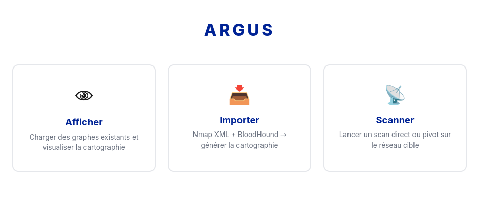
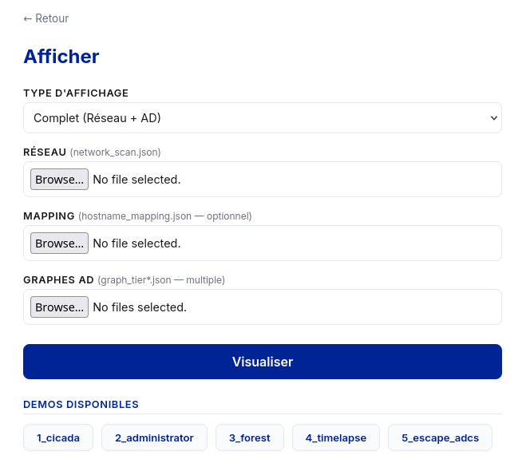
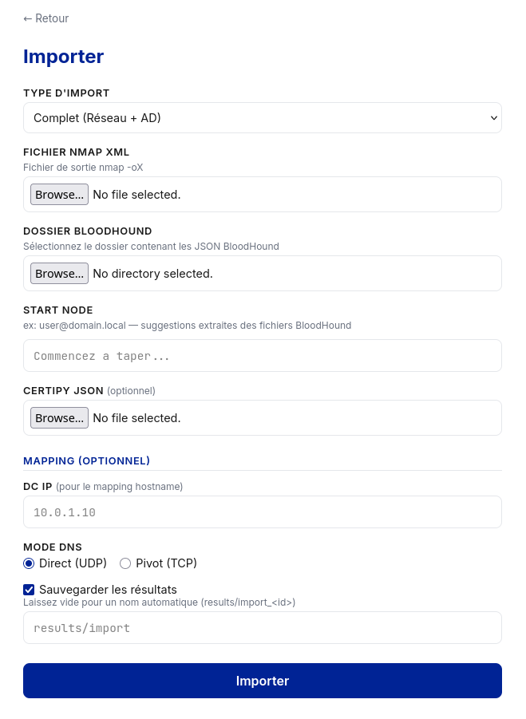
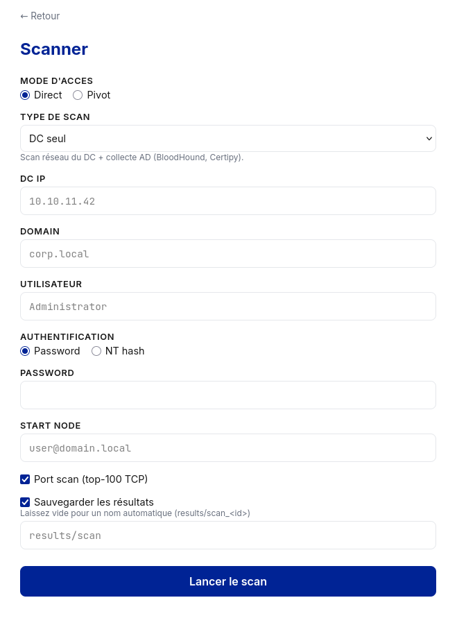
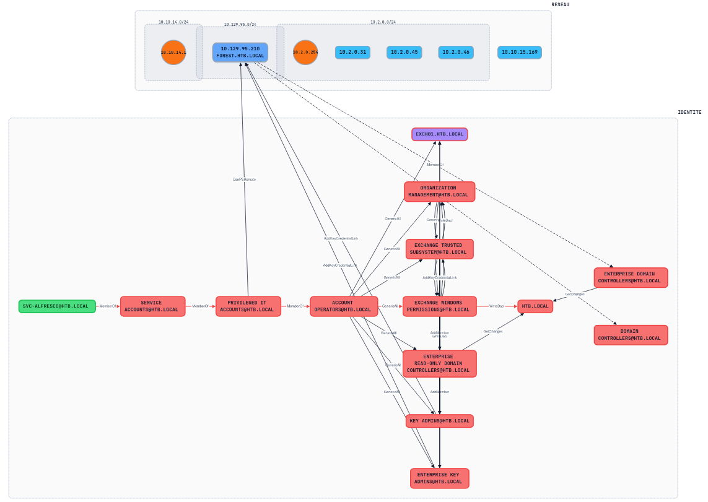
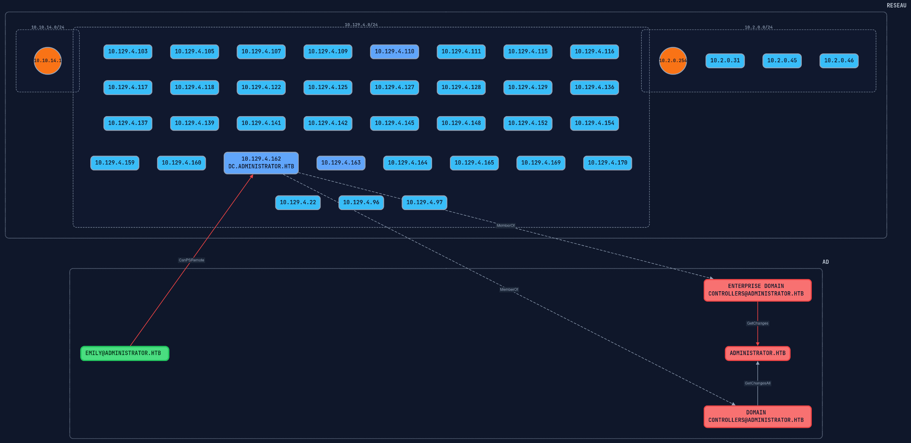
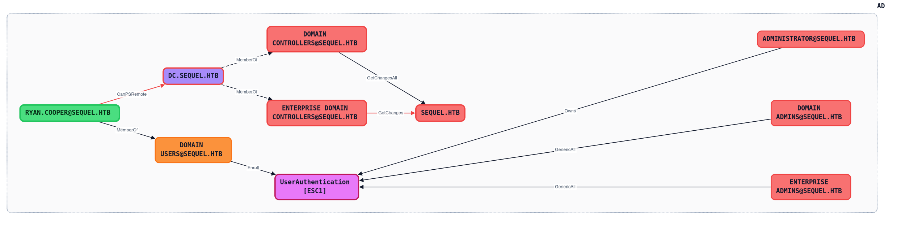

<p align="center">
  
</p>
<h3 align="center">Cartographie Réseau & Active Directory</h3>

---

## Contexte

Dans le cadre d'un audit de SI interne, ARGUS permet de cartographier un réseau inconnu et de générer les chemins d'attaque du domaine Active Directory — le tout depuis une machine compromise.

Les outils existants cloisonnent la vision de l'auditeur : soit le réseau, soit l'AD, jamais les deux ensemble. ARGUS fusionne ces deux mondes dans une cartographie unique pour que l'auditeur puisse voir simultanément la partie réseau (routeurs, flux, machines, ports, services, sous-réseaux) et la partie identité (objets AD, permissions, chemins de compromission) — et raisonner sur l'ensemble sans cloisonnement.

## Conception

Pour ce faire, nous avons conçu :

- **Un algorithme de découverte réseau** capable de cartographier un réseau inconnu depuis une machine compromise (ARP, traceroute multi-méthode, ICMP, scan de ports).

- **Un algorithme de classification des objets AD** — c'est le cœur du projet. Après avoir étudié le fonctionnement de BloodHound, nous avons constaté qu'il ne répondait pas à deux questions fondamentales pour un auditeur : *quels objets sont importants sur le domaine ?* et *comment atteindre ces objets depuis un point de départ ?*

  Nous avons donc conçu un algorithme qui détermine la criticité de chaque objet AD et construit les chemins d'attaque vers ces objets. Ce travail a nécessité une étude approfondie des permissions et des relations complexes d'un domaine Active Directory. L'algorithme repose sur un modèle de classification en **tiers** :

  - **Tier 0** — Objets dont le contrôle du domaine est **certain** (attribution native, héritage direct, héritage indirect, appartenance)
  - **Tier 1** — Objets proches du contrôle (permissions ambiguës, à vérifier)
  - **Tier 2** — Vision globale de tous les chemins possibles vers le Tier 0

  L'objectif est de fournir un outil fiable, dont les résultats sont déterministes et en qui l'auditeur peut avoir confiance.

- **L'intégration des vulnérabilités ADCS** (certificats PKI) directement dans les graphes de chemins d'attaque, pour centraliser toute l'analyse.

## Portabilité

Le vrai plus d'ARGUS est sa portabilité. En pratique, peu de pentesters vont utiliser un outil tiers pour lancer leurs scans — ils ont déjà leurs habitudes. En revanche, ils peuvent faire leurs scans nmap et collecter les données LDAP avec leurs propres outils, puis les importer dans ARGUS pour générer les cartographies.

Les modules sont indépendants : un red teamer peut collecter un AD avec SharpHound et utiliser uniquement ARGUS pour générer les chemins d'attaque. C'est probablement la fonctionnalité la plus utile en cas pratique, vu la simplicité et l'efficacité de la classification d'objets AD par rapport à BloodHound ou d'autres outils.

**On collecte avec l'outil de son choix, on analyse avec ARGUS.**

---

## Interface



### Fonctionnalités

ARGUS propose 3 modes d'utilisation :

**Afficher** — Visualiser des cartographies déjà générées



**Importer** — Importer des données existantes (nmap, BloodHound, Certipy) et générer les cartographies



**Scanner** — Lancer les scans, récolter les données et générer les cartographies



### Affichage des tiers


### Exemples de cartographies

ARGUS produit une visualisation interactive à deux couches. La partie supérieure affiche la topologie réseau (sous-réseaux, machines, passerelles). La partie inférieure affiche les chemins d'attaque AD avec les permissions entre objets. Les ponts relient les machines physiques à leurs objets Computer AD.

**Tier 0 — Forest (HTB)** : graphe complexe, groupes privilégiés et multiples chemins d'escalade vers le domaine.



**Tier 0 — Administrator (HTB)** : chemin d'attaque linéaire emily → ethan → DCSync avec la couche réseau associée.



**Tier 0 — AD seul** : chemins d'attaque AD sans couche réseau, uniquement la classification des objets et leurs relations.



---

## Quick Start

### Prérequis

- Python 3.8+
- `nmap` et `traceroute` (avec accès sudo pour le scan réseau)
- `bloodhound-python` et `certipy-ad` (collecteurs AD)

### Installation

```bash
git clone https://github.com/Les-Infectes/ARGUS && cd argus
python3 -m venv .env
source .env/bin/activate
pip install -r requirements.txt
```

### Lancement

```bash
# Interface web
python3 argus_server.py
# Ouvrir http://localhost:5000

# Avec scan réseau (nécessite sudo)
sudo .env/bin/python3 argus_server.py
# Ouvrir http://localhost:5000
```

---

## Documentation

La documentation technique détaillée est disponible dans le dossier [docs/](docs/) :

| Document | Contenu |
|----------|---------|
| [01 — Pipeline](docs/01-pipeline.md) | Architecture et enchaînement des étapes |
| [02 — Réseau](docs/02-network.md) | Algorithmes de découverte réseau (direct et pivot) |
| [03 — Classification](docs/03-classification.md) | Algorithme de classification en tiers (attribution, héritage, BFS) |
| [04 — Mapping](docs/04-mapping-reseau-ad.md) | Résolution hostname → IP (DNS, SMB) |
| [05 — Collecteurs](docs/05-collecteurs.md) | BloodHound et Certipy : collecte et traduction |
| [06 — Cartographie](docs/06-cartographie.md) | Interface de visualisation HTML |
| [07 — Import](docs/07-import.md) | Import de scans externes et portabilité |
| [08 — CLI](docs/08-CLI.md) | Commandes en ligne de commande (sans interface graphique) |

---

## Dépendances

| Paquet | Usage |
|--------|-------|
| `python-nmap` | Interface Python pour nmap |
| `bloodhound` | Collecteur BloodHound Python (LDAP + SMB) |
| `dnspython` | Résolution DNS directe vers le DC |
| `flask` | Serveur web pour l'interface |
| `certipy-ad` | Énumération ADCS (installé séparément) |

Outils système requis : `nmap`, `traceroute`, `proxychains4` (mode pivot uniquement).

---

## Auteurs

- Laurent MINATCHY
- Maxime HERRY
- Albert BRAME

---

**ARGUS** — *Cartographie unifiée pour l'audit Active Directory*
