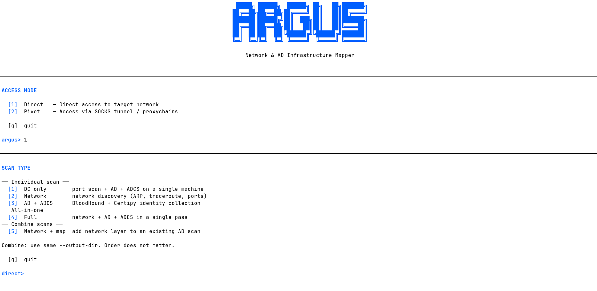

<p align="center">
  
</p>
<h3 align="center">Cartographie Réseau & Objets Active Directory</h3>

ARGUS fusionne automatiquement l'infrastructure réseau (IPs, services, topologie) et le graphe d'identité Active Directory (utilisateurs, groupes, permissions, chemins d'attaque) dans une interface de visualisation interactive unique.

---

## Qu'est-ce qu'ARGUS ?

Dans un audit Active Directory, deux mondes coexistent sans se parler :

- **Le réseau** : des machines identifiées par leurs adresses IP, leurs ports ouverts, leurs services.
- **L'identité** : des utilisateurs, des groupes, des permissions — reliés par des chemins d'attaque potentiels.

ARGUS est le pont entre ces deux mondes. À partir d'un compte utilisateur AD compromis, l'outil :

1. **Scanne le réseau** pour découvrir les machines actives, les sous-réseaux et les services exposés.
2. **Collecte les données AD** via BloodHound (identités, ACLs, sessions) et Certipy (vulnérabilités ADCS).
3. **Classifie les objets AD en tiers** (Tier 0, 1, 2) selon leur proximité aux actifs critiques du domaine.
4. **Fusionne les deux couches** en reliant chaque machine réseau à son objet Computer AD correspondant.
5. **Visualise le tout** dans une cartographie interactive HTML — réseau en haut, identité en bas, ponts entre les deux.

---

## Cartographie

ARGUS produit une visualisation interactive à deux couches. La partie supérieure affiche la topologie réseau (sous-réseaux, machines, passerelles). La partie inférieure affiche les chemins d'attaque AD avec les permissions entre objets. Les ponts relient les machines physiques à leurs objets Computer AD.

**Tier 0 — Forest (HTB)** : graphe complexe avec Exchange, groupes privilégiés et multiples chemins d'escalade vers le domaine.


**Tier 0 — Administrator (HTB)** : chemin d'attaque linéaire emily → ethan → DCSync avec la couche réseau associée.


**Wizard interactif** : interface CLI guidée avec choix des modes et des scans.



---

## Quick Start

### Prérequis

- Python 3.8+
- `nmap` et `traceroute` installés (avec accès sudo pour le scan réseau)
- `bloodhound-python` et `certipy-ad` (collecteurs AD)

### Installation

```bash
git clone https://github.com/Les-Infectes/ARGUS && cd argus
python3 -m venv .env
source .env/bin/activate
pip install -r requirements.txt
```

### Premier lancement

```bash
# Wizard interactif (recommandé)
python3 argus.py

# Ou directement : scan AD + ADCS depuis un compte compromis
sudo .env/bin/python3 argus_pipeline.py \
    --domain corp.local \
    --dc-ip 10.0.1.10 \
    --user john.doe \
    --password 'P@ssw0rd' \
    --start "john.doe@corp.local" \
    --ip-cidr 10.0.1.0/24 \
    --gateway 10.0.1.1 \
    --dns 10.0.1.10 \
    --output-dir results/corp
```

### Visualisation

Ouvrir `cartographie.html` dans un navigateur (double-clic) et charger les fichiers générés (`network_scan.json`, `graph_tierX.json`, `hostname_mapping.json`) pour afficher la cartographie complète.

---

## Modes d'utilisation

> Toutes les commandes ci-dessous peuvent etre generees automatiquement par le wizard interactif : `python3 argus.py`

### Mode direct

L'attaquant est directement connecté au réseau cible. ARGUS effectue une découverte complète : ARP, traceroute, ICMP, scan de ports TCP. La résolution des hostnames AD se fait par requêtes DNS directes au Domain Controller.

```bash
# Scan complet (réseau + AD + ADCS)
sudo .env/bin/python3 argus_pipeline.py \
    --ip-cidr 10.0.1.0/24 --gateway 10.0.1.1 --dns 10.0.1.10 \
    --domain corp.local --dc-ip 10.0.1.10 \
    --user john.doe --password 'P@ssw0rd' \
    --start "john.doe@corp.local"
```

### Mode pivot

L'attaquant accède au réseau cible à travers un tunnel SOCKS (proxychains). Le scan réseau est limité au TCP (`nmap -sT`) car proxychains intercepte les appels `connect()` via `LD_PRELOAD` — les raw sockets (ARP, ICMP, SYN) ne passent pas par le tunnel. Les IPs cibles doivent être connues à l'avance.

```bash
# Passe 1 — AD + ADCS via proxychains
proxychains4 -f proxy.conf .env/bin/python3 argus_pipeline.py \
    --skip-network \
    --domain corp.local --dc-ip 10.0.1.10 --dc-hostname dc01.corp.local \
    --user john.doe -H ':<NT_HASH>' \
    --start "john.doe@corp.local" --dns-tcp \
    --output-dir results/corp

# Passe 2 — Scan réseau pivot (sudo, IPs connues)
sudo .env/bin/python3 argus_pipeline.py \
    --ip-cidr 10.0.1.0/24 \
    --proxychains-conf proxy.conf --targets '10.0.1.10,10.0.1.20,10.0.1.30' \
    --domain x --dc-ip x --user x --password x --start "x@x" \
    --skip-bloodhound --bh-dir results/corp/bloodhound_data \
    --skip-certipy --skip-enrichment \
    --output-dir results/corp
```

### Mode import

ARGUS peut aussi generer la cartographie a partir de fichiers existants, sans relancer de scan. Un pentester qui a deja ses fichiers nmap (`-oX`) et BloodHound peut directement les importer :

```bash
# Import complet (nmap XML + BloodHound)
python3 argus_import.py --nmap-xml scan.xml --bh-dir bloodhound_data/ --start user@domain.local

# Avec mapping hostname (DC encore accessible)
python3 argus_import.py --nmap-xml scan.xml --bh-dir bloodhound_data/ --start user@domain.local --dc-ip 10.0.1.10
```

---

## Scripts

| Script | Rôle |
|--------|------|
| `argus.py` | Wizard interactif — point d'entrée principal |
| `argus_pipeline.py` | Orchestrateur du pipeline complet |
| `argus_network.py` | Scan réseau (ARP, traceroute, ports) |
| `argus_enrich.py` | Résolution hostname AD → IP (DNS / SMB) |
| `argus_builder.py` | Générateur de graphes avec classification en tiers |
| `argus_graph.py` | Exécution des 3 modes de tiers |
| `argus_certipy.py` | Traducteur Certipy → format ARGUS |
| `argus_import.py` | Import de scans externes (nmap XML, BloodHound) |

---

## Documentation

La documentation technique détaillée est disponible dans le dossier [docs/](docs/) :

| Document | Contenu |
|----------|---------|
| [01 — Pipeline](docs/01-pipeline.md) | Architecture et enchaînement des étapes |
| [02 — Réseau](docs/02-network.md) | Algorithmes de découverte réseau (direct et pivot) |
| [03 — Classification](docs/03-classification.md) | Algorithme de classification en tiers (SEED, CLOSURE, BFS) |
| [04 — Mapping](docs/04-mapping-reseau-ad.md) | Résolution hostname → IP (DNS, SMB) |
| [05 — Collecteurs](docs/05-collecteurs.md) | BloodHound et Certipy : collecte et traduction |
| [06 — Cartographie](docs/06-cartographie.md) | Interface de visualisation HTML |
| [07 — Import](docs/07-import.md) | Import de scans externes et portabilite |

---

## Dépendances

| Paquet | Usage |
|--------|-------|
| `python-nmap` | Interface Python pour nmap |
| `bloodhound` | Collecteur BloodHound Python (LDAP + SMB) |
| `dnspython` | Résolution DNS directe vers le DC |
| `certipy-ad` | Énumération ADCS (installé séparément) |

Outils système requis : `nmap`, `traceroute`, `proxychains4` (mode pivot uniquement).

---

## Auteurs

- Laurent MINATCHY
- Maxime HERRY
- Albert BRAME

---

**ARGUS** — *Cartographie unifiée pour l'audit Active Directory*
